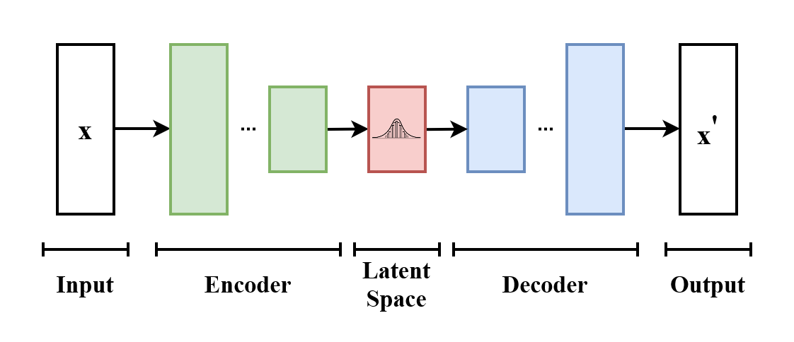

# Loss functions

In this chapter, we'll leverage our newfound KL superpowers to tackle machine learning. We will understand a crucial aspect of it: [setting up loss functions](00-riddles#machine-learning). 

The main point here is that KL divergence and its friends cross-entropy & entropy are a guiding beacon: **Starting with a rough idea about important aspects of data, they help us build a concrete estimation algorithm**. Specifically, we can use the _maximum entropy principle_ to transform our initial concept into a fully probabilistic model, and then apply _maximum likelihood_ to derive the loss function that needs to be optimized.

<KeyTakeaway>
Maximum entropy and maximum likelihood principles explain many machine-learning algorithms. 
</KeyTakeaway>

## Good old machine learning 

In the following widget, you can explore four problems. The first one, estimating the mean & variance of a bunch of numbers, is a classical statistics problem. The following ones - linear regression, $k$-means, logistic regression - are "good old machine learning problems", it's the kind of stuff you see in ML 101 class before diving into neural networks. 

I want to convey how it all __makes sense__. Starting with some simplistic visual feel for what we want (like the picture in the widget's canvas), maximum entropy gives us a concrete probabilistic model for what's happening. We can then minimize the cross-entropy (or, if you want, use maximum likelihood approach) to find the best parameters. 

<MLProblemExplorer />

---

<RiddleExplanation id = "statistics">
I love how mathematics typically has clear answers. We all agree on how to add numbers, compute areas under curves, and handle probabilities. This clarity is exactly what makes statistics<Footnote>I mean frequentist statistics [discussed earlier](04-mle#fisher). </Footnote> so frustrating. There's not even a single obviously right way to estimate the sample variance of a bunch of numbers! Sure, the formula should look roughly like this: 
<Math displayMode={true} math="\hat{\sigma}^2 = \frac{1}{n} \sum_{i=1}^{n} (X_i - \hat{\mu})^2" />
Indeed, this is what we derived using maximum entropy and MLE in the widget above. But there are competing approaches. 

Consider what happens when $n = 1$: our formula always gives zero. But the underlying process that generated the data likely has nonnegative variance — yet we always answer 0! Our estimate is [biased](https://en.wikipedia.org/wiki/Bias_of_an_estimator); it systematically underestimates the true variance. To make it unbiased, we'd need: <Math math="\hat{\sigma}^2 = \frac{1}{n-1} \sum_{i=1}^{n} (X_i - \hat{\mu})^2" />. Meanwhile, the formula <Math math="\hat{\sigma}^2 = \frac{1}{n+1} \sum_{i=1}^{n} (X_i - \hat{\mu})^2" /> minimizes [mean squared error](https://en.wikipedia.org/wiki/Mean_squared_error) to the true variance. 

Among these approaches, MLE is the most flexible and widely used in machine learning (as we've seen). I hope this text gives some intuition why: MLE isn't just an ad hoc formula. It's ultimately about our Bayesian detective trying to separate truth from fiction. 
{/* MLE says a model is good when it's hard to distinguish from the truth using Bayes' rule. */}

</RiddleExplanation>

If all the above applications are a bit too easy, here's a more complicated one - setting up the loss of a particular neural network architecture for working with images, called variational autoencoders. 

<Expand advanced={true} headline="Variational autoencoders"> 

### Autoencoders

I want to show you a more complicated application of our techniques. We will now derive the loss function for [variational autoencoder](https://en.wikipedia.org/wiki/Variational_autoencoder). That's a neural network architecture that looks like the image below. 

To understand what it's for, let's talk about _pixel space_ and _latent space_. The pixel space is how we usually think about images and how we store them in memory - a list of pixel values. The latent space is how we actually think about pictures - two images of a dog are close to each other in the latent space, but not necessarily in the pixel space. <Footnote>See e.g. [this video](https://nvlabs-fi-cdn.nvidia.com/stylegan2-ada-pytorch/videos/interpolations-ffhq.mp4) for what intepolation of two images in the latent space looks like. This uses a more complicated approach than just autoencoders. </Footnote>

Variational autoencoder is a neural network architecture that tries to build this latent space. The basic idea is of autoencoders is to build the network by stitching two pieces - the encoder and the decoder. In particular, given an input image $x$, an autoencoder net runs it through the encoder, $\textrm{Enc}(x)$, and compresses it into a smaller list of numbers $y$. Subsequently, a decoder, $\textrm{Dec}(y)$, attempts to reconstruct the original image $x$. 

Importantly, the space that $y$ lives in is smaller than the original pixel space. The hope is that due to this bottleneck, $y$ captures the essential aspects of image $x$ while discarding the less important ones. In other words, we hope that $y$ lives in the latent space.

One challenge with traditional autoencoders is their tendency to learn a "hash function": The decoder might simply memorize all images $x_1, x_2, \dots$, and the encoder and decoder then decide on "names" for these images. The encoder then merely converts an input image to its name, and the decoder outputs the image associated with that name. To combat this issue, practitioners use _variational autoencoders_. These are autoencoders where the encoder outputs two lists: $\mu_1, \dots, \mu_d$ and $\sigma^2_1, \dots, \sigma^2_d$. The input to the decoder consists of $d$ samples drawn from $N(\mu_1, \sigma_1^2), \dots, N(\mu_d, \sigma_d^2)$. By introducing noise in the middle of the architecture, it becomes more difficult for the network to "cheat" by simply memorizing all images.

### The two models of the world

The question now is: How do we optimize the variational autoencoder? Specifically, what is the loss function to minimize? Let's try to derive it! This will be more challenging than previous examples, hopefully demonstrating the depth of what we've learned so far!

Where do we begin? The first item on our to-do list is to formulate a probabilistic model of our data. In our setup, the ultimate hope is to build a one-to-one function mapping between the pixel space and the latent space. But as we saw, the point of variational autoencoders is to 'smoothen' this problem. So, instead of thinking of a function, we should think instead of a joint distribution $p(x, y)$. Here, the first parameter $x$ is the image in pixel space, and $y$ is the its latent space description. 

Now, the encoder and decoder represent two distinct ways in which we can factorize the joint distribution.
The encoder corresponds to the factorization $p(x,y) = p(x) \cdot p(y | x)$: First, sample a random image and then encode it into the latent space. The distribution $p(x)$ is known to us: it's the empirical distribution over the large dataset of images we collected for training our autoencoder.
Unfortunately, the distribution $p(y | x)$ is not known. The encoder attempts to model it though. We can hence represent the distribution $p(y | x)$ by <Math math = "p'(y | x) = N(\textrm{Enc}_\mu(x), \textrm{Enc}_{\sigma^2}(x))" /> and have 
<Math displayMode={true} math = "p(x, y) \approx p(x) \cdot p'(y | x)"/>

The decoder provides us with a second way to model the data: We first sample a random latent-space representation and then decode it into an image, i.e., $p(x,y) = p(y) \cdot p(x|y)$. We need to be more creative to transform this idea into a concrete probabilistic model. For a start, we don't know the marginal distribution $p(y)$. Let's simply model it with a Gaussian distribution $q(y) = N(0, I)$ ($I$ represents the identity matrix). How should we model $p(x|y)$? Using $\textrm{Dec}(y)$ is a good starting point, but this is a deterministic funciton of the input, while we want a probability distribution. Similarly to how we constructed $p'(y | x)$, let's add some noise to the final output. Concretely, we will add Gaussian noise $N(0,1)$ to every pixel of the final image. Our model of $p(x|y)$ is $q(x|y) = N(\textrm{Dec}(y), I)$. We have arrived at a different probabilistic model for $p(x,y)$:

<Math displayMode={true} math="p(x,y) \approx q(y) \cdot q(x|y)" />

We will optimize our variational autoencoder by minimizing the KL divergence between these two models of $p(x,y)$. When using KL divergence, we typically want the first parameter to represent the "truth" and the second to be a model of it. In this instance, both distributions are models of $p(x,y)$ that we train in unison. However, the first model, $p(x,y) = p(x) \cdot p'(y|x)$, is a bit closer to the truth since it incorporates the actual empirical distribution over the data $p(x)$. So, let's minimize the following expression:

<Math displayMode={true} math = "D\left( p(x) \cdot p'(y | x),\,\,\, q(y) \cdot q(x|y)\right)" />

The hard part is done! Finishing the job now boils down to algebra autopilot that I hid in the following Expand box so as not to scare you right away. 

<Expand headline="Algebra part">
Let's call our KL loss function $\mathcal L$. We can decompose it into two parts, known as the **reconstruction loss** and the **regularization term**:

<Math displayMode = {true} math = "\begin{align*} \mathcal L &= \sum_{x,y} p(x) p'(y|x) \log \frac{p(x) p'(y|x)}{q(x|y)q(y)} \\ &= \underbrace{\sum_{x,y} p(x) p'(y|x) \log \frac{p(x)}{q(x|y)}}_{\textrm{Reconstruction loss } \mathcal L_1} + \underbrace{\sum_{x,y} p(x) p'(y|x) \log \frac{p'(y|x)}{q(y)}}_{\textrm{Regularization term } \mathcal L_2} \end{align*}" />

Let's analyze each term in turn, starting with the reconstruction loss.

### Reconstruction Loss
Let's further expand the term $\mathcal L_1$:
<Math displayMode={true} math = "\mathcal L_1 = \sum_x p(x) \log p(x) - \sum_{x,y} p(x) p'(y|x) \log q(x|y)"/>
The first term is simply the entropy of the distribution $p(x)$. In our case, $p(x)$ is a uniform distribution over $N$ images $X_1, \dots, X_N$, so it equals $\log N$. In any case, it's a constant independent of all the parameters we optimize, so let's forget it. Minimizing $\mathcal L_1$ amounts to minimizing the second term. 

Now remember that $q(x|y)$ involves running the decoder on $y$ and adding Gaussian noise $N(0,1)$ to each of the $d$ pixels of the resulting image; we therefore have
<Math displayMode={true} math = "q(x | y) \propto e^{-\frac{\| x - \textrm{Dec}(y)\|^2}{2d}}"/>
and hence, up to an additive constant that does not affect our optimization problem, we have
<Math displayMode={true} math = "\log q(x | y) = -\frac{\| x - \textrm{Dec}(y)\|^2}{2d}"/>

So, if we were in the setup of a regular autoencoder where $p'(y|x)$ is a deterministic encoding $\textrm{Enc}(x)$, minimizing the term $\mathcal L_1$ would reduce to minimizing the mean square *reconstruction* loss:
<Math displayMode={true} math = "\frac{1}{N}\sum_{i = 1}^N \frac{\| x_i - \textrm{Dec}(\textrm{Enc}(x_i))\|^2}{2d}. " />

Our case is more complex; we need to minimize:
<Math displayMode={true} math = "\frac{1}{N}\sum_{i = 1}^N \sum_{y} p'(y|x_i) \frac{\| x_i - \textrm{Dec}(y)\|^2}{2d}. " />

The term $p'(y|x)$, which samples from <Math math = "N(\textrm{Enc}_\mu(x), \textrm{Enc}_{\sigma^2}(x))" /> instead of being a deterministic encoding, is problematic to compute directly. We will discuss how to estimate this part of the loss function at the end.

### Regularization Term

Let's analyze the term <Math math = "\mathcal L_2 = \sum_{x,y} p(x) p'(y|x) \log \frac{p'(y|x)}{q(y)}" />. Remember, $p(x)$ is simply a uniform distribution over our image dataset, so we can rewrite this as:
<Math displayMode={true} math = "\mathcal L_2 = \sum_{i = 1}^N \frac{1}{N} \sum_y p'(y|x_i) \log \frac{p'(y|x_i)}{q(y)} = \sum_{i = 1}^N \frac{1}{N} D(p'(y|x_i), q(y))"/>
Thus, minimizing this term reduces to minimizing the sum of KL divergences between $p'(y|x_i)$ and $q(y)$ across our dataset $x_1, \dots, x_N$.

The first distribution $p'(y |x_i)$ is simply a Gaussian with mean $\textrm{Enc}_\mu(x_i)$ and variance that is a diagonal matrix with entries <Math math = "\textrm{Enc}_{\sigma^2}(x_i)" />. The second distribution $q(y)$ is precisely the Gaussian $N(0,I)$. There's a [simple formula](https://leenashekhar.github.io/2019-01-30-KL-Divergence/) for the KL divergence between two Gaussians that looks like this:
<Math displayMode = {true} math = "D(N(\mu, \sigma^2), N(0, I)) = \frac12 \sum_{j = 1}^d \left( \mu_j^2 + \sigma_j^2 - 1 - \log\sigma_j^2\right) "/>

Plugging this into $\mathcal L_2$, we find that we need to minimize the expression:
<Math displayMode = {true} math = "\frac{1}{N} \sum_{i = 1}^N \left( \frac12 \sum_{j = 1}^d \textrm{Enc}_{\mu, j}(x_i)^2 + \textrm{Enc}_{\sigma^2, j}(x_i) - \log \textrm{Enc}_{\sigma^2, j}(x_i) \right)"/>
This is called the regularization term since it ensures that our variational autoencoder can't simply degenerate into a vanilla autoencoder by setting $\sigma_i^2 = 0$.
</Expand>

After performing the algebra, we arrive at the following loss function:
<Math displayMode={true} math = "\frac{1}{N} \sum_{i = 1}^N \left( \sum_y p'(y | x_i) \frac{\| x_i - \textrm{Dec}(y)\|^2}{2d} \,+\, \left( \frac12 \sum_{j = 1}^d \textrm{Enc}_{\mu, j}(x_i)^2 + \textrm{Enc}_{\sigma^2, j}(x_i) - \log \textrm{Enc}_{\sigma^2, j}(x_i) \right)\right)"/>

In general, computing this expression <Math math = "\sum_{i = 1}^N \sum_y p'(y | x_i) \frac{\| x_i - \textrm{Dec}(y)\|^2}{2d}"/> is super hard, since it requires iterating over all the whole range of $p'(y|x_i)$. In practice, this expression can be estimated using the Monte Carlo method. 
That is, for each image $x_i$, we simply sample a few times from $p'(y|x_i)$ and each time compute the reconstruction loss $\| x_i - \textrm{Dec}(y)\|^2$. The average of these few samples is our estimate of the average reconstruction loss. 
</Expand>

## What's next? 

We are done with optimizing KL divergence and setting up loss functions! In the [final chapter](08-coding_theory), we will see how entropy, cross-entropy, and KL divergence are connected to text encoding and what it tells us about large language models.    

